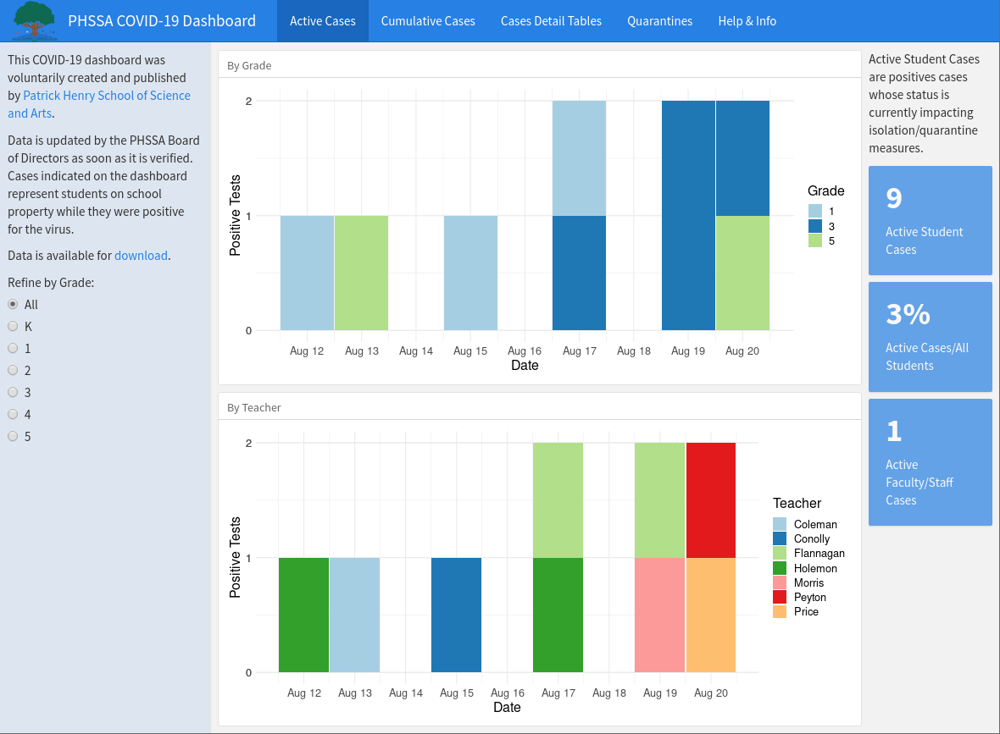

# School COVID Dashboard

This is a basic COVID-19 positive case tracking dashboard published as a [Shiny](shinyapps.io) application for a school to track student cases. It's built in R with flexdashboard and DT for interactivity. The back end is a Google Sheet set to public view. School officials can easily add new cases to the Google Sheet and changes are reflected in the dashboard.

